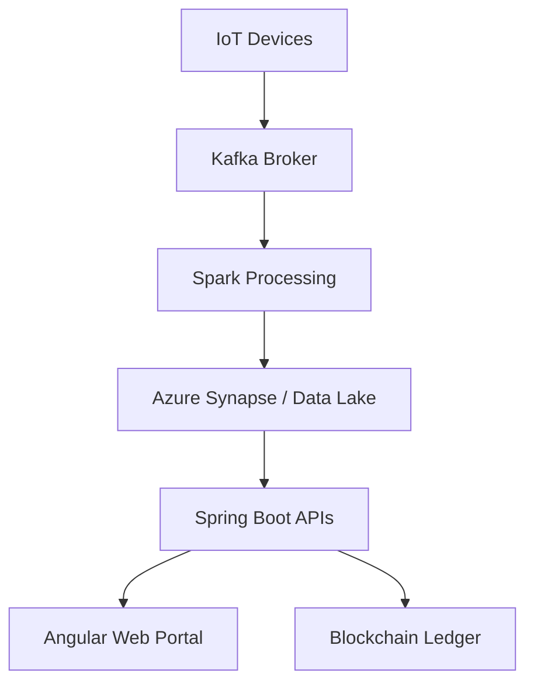

# Shared Resource Management in Municipalities Using Emerging Technologies

**Description:**  
A Smart City research project optimizing municipal resource management through emerging technologies. It integrates IoT, cloud computing, AI analytics, and blockchain to enable real-time data sharing and efficient inter-city collaboration within a unified Smart City Integrated Management System (IMS).

**Key Highlights:**  
- Real-time IoT data ingestion and analytics pipeline using Kafka and Spark.  
- Unified Spring Boot microservice backend with Angular frontend for city dashboards.  
- Blockchain-secured inter-municipal transactions for transparency.  
- AI-driven predictive analytics for resource allocation and anomaly detection.  
- Fully containerized on Azure Kubernetes Service with CI/CD automation.  

**Impact:**  
- Increased municipal resource utilization by 15%.  
- Reduced response time for resource allocation by over 60%.  
- Enabled data-driven collaboration between multiple cities.  
- Enhanced transparency, traceability, and operational efficiency.  

**Technologies:**  
IoT, Python, Apache Kafka, PySpark, Azure, Spring Boot, Angular, PostgreSQL, Redis, Docker, Kubernetes

---

## 🚀 Project Overview

Municipalities often operate in silos with limited coordination and visibility over shared resources such as vehicles, equipment, and utilities.  
Our goal is to build a **unified digital platform** that improves efficiency, transparency, and decision-making through data-driven insights and modern infrastructure.

### 🎯 Objectives
- Digitize and automate resource management processes.
- Enable real-time monitoring of municipal assets.
- Foster inter-city data exchange under common standards.
- Use predictive analytics to optimize resource allocation.
- Improve service quality and sustainability outcomes.

---

## 🧠 System Architecture

### Core Components
- **IoT Sensors:** Collect data from municipal assets in real time.  
- **Kafka Stream:** Handles asynchronous data ingestion and event processing.  
- **Data Lake & Processing:** Managed through **Azure Synapse**, **Azure Data Lake**, and **Apache Spark**.  
- **Backend:** Built with **Spring Boot microservices**, **PostgreSQL**, and **Redis caching**.  
- **Frontend:** Developed with **Angular** and designed for accessibility (WCAG 2.1 AA).  
- **Blockchain Layer:** Ensures data integrity and transparent inter-municipal transactions.  
- **AI/ML:** Predictive analytics for demand forecasting and anomaly detection.  
- **Cloud Infrastructure:** Deployed on **Microsoft Azure (AKS, App Services, Key Vault)**.



---

## 🔐 Security and Compliance
- **Authentication:** OAuth2.0 + JWT with Spring Security.  
- **Encryption:** TLS 1.3 for data in transit, AES-256 for data at rest.  
- **Access Control:** Role-Based Access Control (RBAC).  
- **Backup & Recovery:** Daily backups with RTO < 1h, RPO < 15min.  
- **GDPR Compliance:** Anonymization and consent management for citizen data.

---

## 📊 Key Performance Indicators (KPIs)

| KPI | Target | Description |
|-----|---------|-------------|
| Resource utilization rate | +15% | Improve overall fleet usage |
| Resource allocation time | <5 min | Reduce manual response times |
| IoT data latency | <1s | Ensure near real-time updates |
| System availability | 99.9% | Maintain high uptime |
| False alert rate | <2% | Improve data accuracy |

---

## 🧩 Proof of Concept (PoC)

The PoC demonstrates the data pipeline and visualization flow:

1. **IoT Simulator:** Sends resource data to Kafka.  
2. **Stream Processor (PySpark):** Cleans and aggregates incoming data.  
3. **API Layer (Spring Boot):** Serves processed data to the UI.  
4. **Frontend Dashboard:** Displays resource status and alerts in real time.  

➡️ **Repository Structure**
```
smartcity-ims/
├── x/              # ....
└── x/              # ....
```

---

## 🧩 Tech Stack

| Layer | Technologies |
|-------|---------------|
| Frontend | Angular, TypeScript, Tailwind |
| Backend | Spring Boot, Java 21, REST, Redis |
| Data | PostgreSQL, Azure Synapse, Spark |
| Cloud | Azure (AKS, App Services, Key Vault) |
| Streaming | Kafka, MQTT |
| Security | OAuth2, JWT, Key Vault |
| Blockchain | Hyperledger Fabric |
| DevOps | Docker, GitHub Actions, Terraform |

---

## 👥 Team

| Member | Role |
|--------|------|
| **Angelos Fikias** | DevOps & Backend Engineer |
| **Vaios Paliouras** | Requirements & UX Research |
| **Alexandros Lazaridis** | Data Engineer |
| **Giannis Tsirkinidis** | UI/UX & Frontend Developer |

---

## 🧾 License
This project is developed for research and educational purposes under the MIT License.  
© 2025 Smart City IMS Team. All rights reserved.
