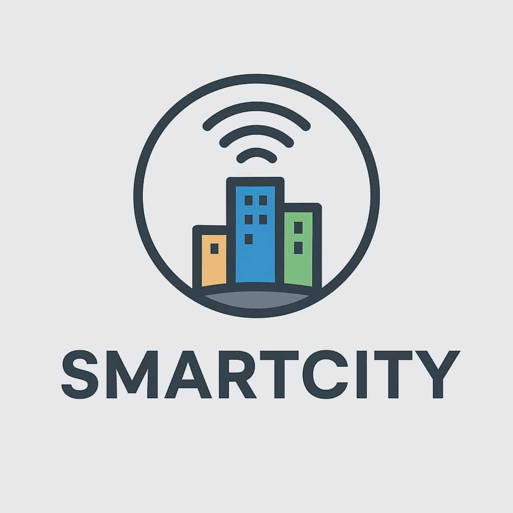

# Shared Resource Management in Municipalities Using Emerging Technologies

A research project focused on optimizing municipal resource management through emerging technologies. This system integrates IoT, cloud computing, AI analytics, and blockchain to enable **real-time data sharing** and **efficient inter-city collaboration** within a unified **Smart City Integrated Management System (IMS)**.

---

## 🚀 Project Overview

Municipalities often operate in silos with limited visibility and coordination over shared resources such as vehicles, equipment, and utilities. This project builds a **digital platform** to:

- Improve operational efficiency
- Increase transparency and traceability
- Enable data-driven decision-making

  
*Logo*

---

## 🎯 Objectives

- Digitize and automate municipal resource management processes.
- Monitor municipal assets in real time.
- Enable inter-city data exchange under common standards.
- Apply predictive analytics for optimal resource allocation.
- Enhance service quality, sustainability, and operational outcomes.

---

## 🧠 System Architecture

  
*Overall architecture of the Smart City Integrated Management System.*

### Core Components

- **IoT Sensors:** Collect real-time data from vehicles, equipment, and utilities.
- **Kafka Stream:** Handles asynchronous data ingestion and event-driven processing.
- **Data Lake & Processing:** Managed with Azure Data Lake, Azure Synapse, and Apache Spark.
- **Backend:** Spring Boot microservices, PostgreSQL, Redis caching.
- **Frontend:** Angular dashboard, fully accessible (WCAG 2.1 AA compliant).
- **Blockchain Layer:** Ensures data integrity and transparent inter-municipal transactions.
- **AI/ML:** Predictive analytics for demand forecasting and anomaly detection.
- **Cloud Infrastructure:** Deployed on Microsoft Azure (AKS, App Services, Key Vault).

  
*Detailed view of system components and their interactions.*

  
*Data flow and database schema representing municipal resource management.*

---

## 🔐 Security and Compliance

- **Authentication:** OAuth2.0 + JWT with Spring Security
- **Encryption:** TLS 1.3 for data in transit, AES-256 for data at rest
- **Access Control:** Role-Based Access Control (RBAC)
- **Backup & Recovery:** Daily backups with RTO <1h, RPO <15min
- **GDPR Compliance:** Citizen data anonymization and consent management

---

## 📊 Key Performance Indicators (KPIs)

| KPI | Target | Description |
|-----|--------|-------------|
| Resource utilization rate | +15% | Increase fleet and equipment usage |
| Resource allocation time | <5 min | Reduce manual response time |
| IoT data latency | <1s | Near real-time data updates |
| System availability | 99.9% | High uptime for critical services |
| False alert rate | <2% | Accurate anomaly detection |

---

## 🧩 Proof of Concept (PoC)

The PoC demonstrates the end-to-end data pipeline and dashboard visualization:

1. **IoT Simulator:** Sends resource data to Kafka.
2. **Stream Processor (PySpark):** Cleans, aggregates, and transforms incoming data.
3. **API Layer (Spring Boot):** Serves processed data to the frontend.
4. **Dashboard (Angular):** Displays resource status, predictive insights, and alerts in real time.

  
*Illustrates the flow from IoT data collection to dashboard visualization.*

---

## 🧩 Tech Stack

| Layer       | Technologies |
|------------|--------------|
| Frontend    | Angular, TypeScript, Tailwind CSS |
| Backend     | Spring Boot, Java 21, REST, Redis |
| Data        | PostgreSQL, Azure Synapse, Apache Spark |
| Cloud       | Microsoft Azure (AKS, App Services, Key Vault) |
| Streaming   | Kafka, MQTT |
| Security    | OAuth2, JWT, Azure Key Vault |
| Blockchain  | Hyperledger Fabric |
| DevOps      | Docker, Kubernetes, GitHub Actions, Terraform |

---

## 👥 Team

| Member               | Role                          |
|---------------------|-------------------------------|
| Angelos Fikias       | DevOps & Backend Engineer     |
| Vaios Paliouras      | Requirements & UX Research    |
| Alexandros Lazaridis | Data Engineer                 |
| Giannis Tsirkinidis  | UI/UX & Frontend Developer    |

---

## 💡 Impact & Results

- **Resource Utilization:** +15% efficiency in municipal asset usage.
- **Response Time:** Over 60% faster allocation of resources.
- **Collaboration:** Multiple cities share data seamlessly under common standards.
- **Transparency:** Blockchain ensures traceable inter-city transactions.
- **Predictive Insights:** AI-driven forecasting minimizes waste and enhances planning.

---

## 🧾 License

This project is developed for **research and educational purposes** under the **MIT License**.  
© 2025 Smart City IMS Team. All rights reserved.
